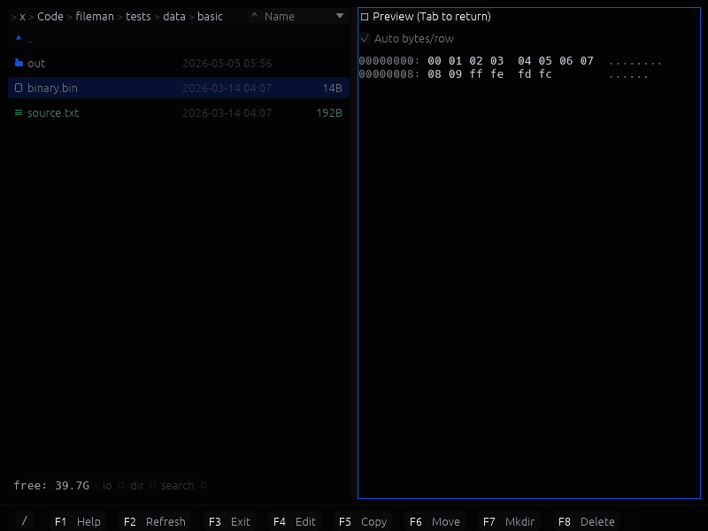

# Fileman

Fileman is a fast, responsive two-panel file manager built with egui via blade-egui. The goal is to keep navigation snappy even in large directories by doing I/O off the UI thread and streaming results into the view.

## Highlights
- Dual-panel layout with independent navigation.
- Non-blocking directory loading and virtualized list rendering.
- Optional previews for text and images.
- External themes in `themes/` (JSON, YAML, or TOML).

## Features (Current)
- Two-panel file browser with independent navigation and history (Alt+Left/Right).
- Async directory listing with streaming batches.
- Search (Alt+F7) with results as a virtual folder.
- Preview mode (F3) for text and images, including archives.
- Inline editor (F4) with syntax highlighting for text files.
- Copy/Move/Delete operations with confirmation dialogs (F5/F6/F8).
- Rename (Shift+F6) and directory size calculation (Space).
- Archive navigation for zip, tar.gz, tar.bz2 (copy out supported).
- Snapshot rendering via `--snapshot` for CI.
- Replay runner for tests via `--replay` (RON format).

## Keyboard Shortcuts
- Navigation: Enter (open), Tab/Ctrl+I (switch panels), Alt+Left/Right (back/forward).
- Parent/child: Backspace/Ctrl+PgUp (parent), Ctrl+PgDn (open selected).
- Panels: Ctrl+Left/Right (open selected dir in the other panel).
- Preview: F3 (toggle), Shift+Enter (open with system default app).
- Edit: F4 (edit), Shift+F4 (new file + inline rename), Shift+F6 (rename).
- Ops: F5 copy, F6 move, F8 delete, Space computes folder size.
- Search: Alt+F7 (name search).
- Properties: Alt+Enter (file properties).
- Refresh: Ctrl+R.
- Theme: F9 (toggle), F10 (picker).

## Screenshot


## Build and Run
```bash
cargo build
cargo run
RUST_LOG=info cargo run
```

## macOS App Bundle
This project uses `cargo-bundle` for macOS bundling. Install it once:
```bash
cargo install cargo-bundle
```
Then build the bundle:
```bash
cargo bundle --release
```
The icon is set via `package.metadata.bundle.icon` in `Cargo.toml` and uses
`etc/macos/icon.png`.

### Test Replays
Replay cases live in `tests/cases/` and use the RON format. To run a case and emit a snapshot:
```bash
cargo run -- --replay tests/cases/preview.ron --snapshot /tmp/replay.png
```
To run all replay cases:
```bash
scripts/replay_runner.sh
```

### GPU Backend Notes
If you see `NoSupportedDeviceFound`, blade-graphics couldn't find a supported GPU backend.
On Linux, this usually means Vulkan drivers aren't available. You can either install Vulkan
drivers or use the GLES fallback:
```bash
RUSTFLAGS="--cfg gles" cargo run
```

## Project Notes
- Rendering uses winit + blade-egui.
- UI responsiveness is a primary requirement; avoid long-running work on the main thread.

## Repository Layout
- `src/main.rs` contains the egui app entry point.
- `src/replay.rs` contains test replay case parsing.
- `themes/` stores theme files.
