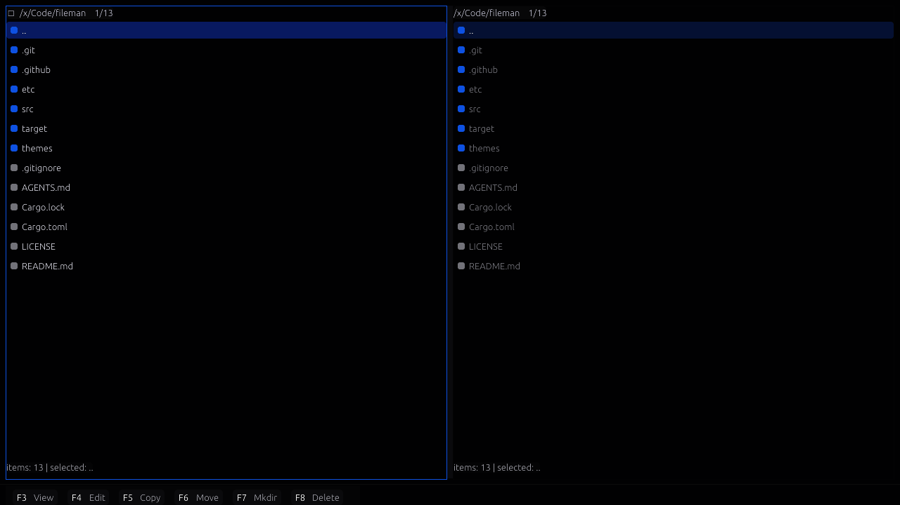

# Fileman

Fileman is a fast, responsive two-panel file manager built with egui via blade-egui. The goal is to keep navigation snappy even in large directories by doing I/O off the UI thread and streaming results into the view.

## Highlights
- Dual-panel layout with independent navigation.
- Non-blocking directory loading and virtualized list rendering.
- Optional previews for text and images.
- External themes in `themes/` (JSON, YAML, or TOML).

## Screenshot


## Build and Run
```bash
cargo build
cargo run
RUST_LOG=info cargo run
```

### GPU Backend Notes
If you see `NoSupportedDeviceFound`, blade-graphics couldn't find a supported GPU backend.
On Linux, this usually means Vulkan drivers aren't available. You can either install Vulkan
drivers or use the GLES fallback:
```bash
RUSTFLAGS="--cfg gles" cargo run
```

## Project Notes
- Rendering uses winit + blade-egui.
- UI responsiveness is a primary requirement; avoid long-running work on the main thread.

## Repository Layout
- `src/main.rs` contains the egui app entry point.
- `themes/` stores theme files.
